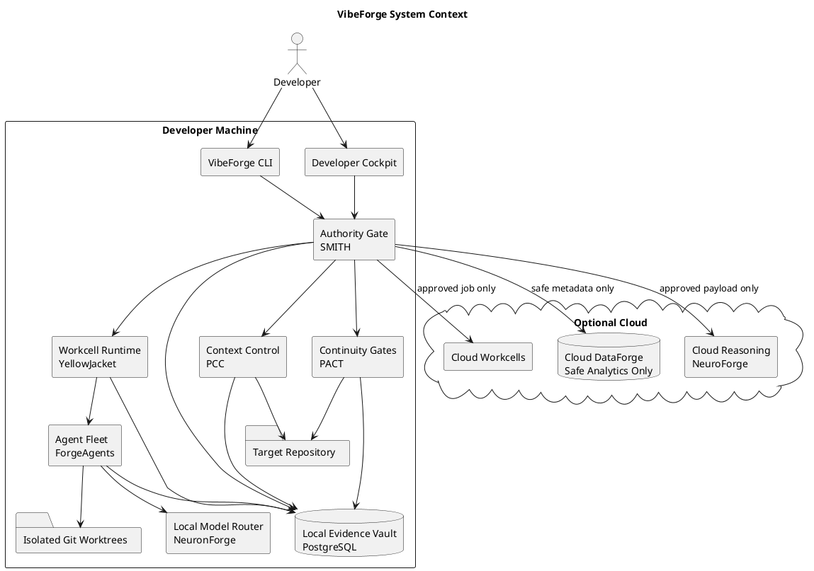
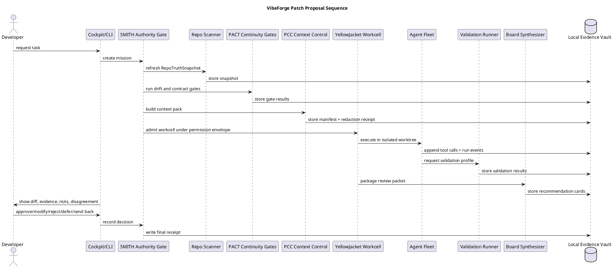
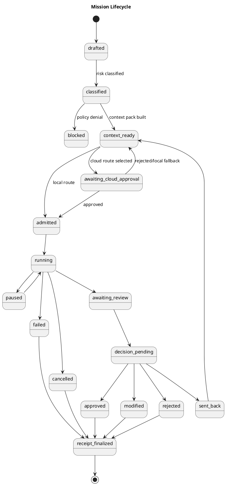

# 03 — Method — Architecture, Trust Lanes, and Workflows

## Comparable product landscape

Many agentic coding tools can now read repositories, edit files, run commands, and prepare pull requests. VibeForge should not compete as "another coder." It should become the trust layer around whichever coder, model, IDE, or cloud agent the developer already uses.

| Product family | Center of gravity | VibeForge premium response |
|---|---|---|
| Cloud coding agents | Remote task execution and PR generation | Govern through payload previews, local receipts, privacy-safe analytics |
| Terminal coding agents | Fast repo edits and command execution | Wrap with permission envelopes, command policy, context manifests, receipts |
| Local coding agents | Developer-machine execution | Require worktree isolation, patch receipts, validation, developer authority |
| AI IDEs | In-editor productivity | Add cross-tool governance, provenance, and auditability |

## Premium architecture principle

```text
Agents propose.
Tools execute inside permission envelopes.
Board reviewers recommend.
SMITH authorizes boundaries.
The developer decides.
The Local Evidence Vault records.
```

## Customer-facing component map

| Customer-facing capability | Internal implementation family |
|---|---|
| Authority Gate | SMITH / forge-smithy |
| Workcell Runtime | YellowJacket |
| Context Control | PCC |
| Continuity Gates | PACT |
| Agent Fleet | ForgeAgents |
| Local Reasoning Router | NeuronForge |
| Cloud Reasoning Router | NeuroForge |
| Evidence Vault | Local PostgreSQL Vault |
| Safe Analytics | Cloud DataForge |
| Developer Cockpit | Forge_Command-inspired cockpit patterns |

## System context



## Core sequence



## Mission lifecycle



## Trust lanes

| Lane | Owns | Never owns |
|---|---|---|
| Target Code Lane | repo scan, isolated worktree, patch candidate, validation | hidden mutation, force push, silent merge |
| Proof Lane | receipts, evidence refs, hashes, validation results, run state | business analytics or cloud pricing |
| Control Lane | policy, permissions, approvals, kill switch, decisions | raw model authority |
| Context Lane | context manifests, redaction, budgets, payload preview | permission to execute/merge |
| Cloud Lane | approved deep review, usage metering, safe analytics | source of truth or unapproved code storage |

## Authority matrix

| Boundary | Default | Approval required | Receipt |
|---|---|---|---|
| Read tracked repo file | allow if scoped | no | tool call event |
| Read ignored/secret-like file | block | explicit or never allowed by class | security event |
| Write isolated worktree | allow if scoped | no for low/medium risk | tool call + patch receipt |
| Write active tree | block | manual developer action outside agent path | decision receipt |
| Run read-only command | allow if allowlisted | no | command receipt |
| Run build/test command | allow if profile-selected | no | command receipt |
| Run network command | block | explicit approval | security event |
| Run destructive command | block | explicit approval or never allowed | security event |
| Cloud model call | block | preview + credit estimate + approval | cloud job receipt |
| Analytics event | allow only if schema passes | no | analytics gate receipt |

## UI rule

Every premium UI surface should follow:

```text
Status → Evidence → Risk → Options → Receipt
```

A green state must mean that local evidence exists and required gates passed. It must never mean "the model said it was okay."
