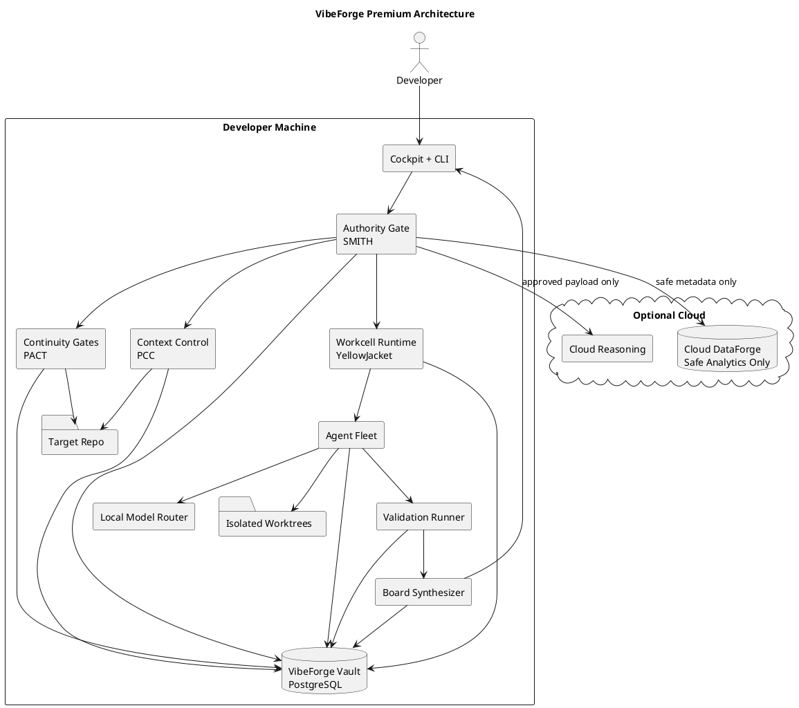

# SPEC-001-VibeForge-Premium-Architecture

## Background

VibeForge began as a plan set for a local-first AI engineering workbench. The original thesis is strong: agentic coding is becoming powerful enough to create serious software changes, but most workflows still lack durable governance, local evidence, privacy control, provenance, and explicit developer authority.

The premium version positions VibeForge as the **governed engineering layer for agentic coding**. It does not compete with coding models on raw generation. It wraps local and cloud coding agents with context control, isolated workcells, board-style review, validation profiles, patch receipts, privacy-safe cloud escalation, and Human-On-The-Loop developer decisions.

Core thesis:

```text
Agentic coding without governance becomes automated technical debt.
VibeForge turns agentic coding into governed engineering.
```

Premium promise:

```text
A developer can prove what changed, why it changed, what context was used, what tests ran, what risks remain, what left the machine, who approved it, and how to roll it back.
```

## Requirements

### Must have

- **M-001 Local-first operation:** Repo scan, local review, local validation, patch candidate, decision, and receipt must work without cloud.
- **M-002 Active tree protection:** Agents never mutate the active working tree by default; changes happen in isolated worktrees.
- **M-003 Local Evidence Vault:** PostgreSQL-backed local vault stores missions, workcells, agent runs, tool calls, context packs, validations, board reviews, decisions, and receipts.
- **M-004 Developer authority:** Developer can approve, approve with modification, reject, defer, or send back any recommendation.
- **M-005 Patch receipts:** Every candidate patch has a hash-backed receipt tied to source commit, context, validation, board review, and decision.
- **M-006 Context control:** Every agent/cloud job receives a bounded context pack with manifest, redaction summary, and hash.
- **M-007 Cloud approval gate:** Cloud jobs require payload preview, estimated credits, redaction summary, explicit approval, and local receipt.
- **M-008 Safe analytics allowlist:** Cloud DataForge receives only safe operational metadata and rejects code, diffs, prompts, outputs, file paths, repo names, branch names, commit messages, and secrets.
- **M-009 Command/path policy:** Commands and file operations are classified and blocked/approval-gated before execution.
- **M-010 Board review MVP:** Security, testing, architecture, and product/reliability reviewers produce evidence-backed recommendation cards.
- **M-011 Kill switch:** User can stop all running workcells and model/tool execution with a cancellation receipt.

### Should have

- **S-001 Premium cockpit:** Desktop UI with dashboard, control room, board inbox, patch queue, receipts, cloud usage, and kill switch.
- **S-002 CLI parity:** Linux-first users can execute core workflows from CLI.
- **S-003 Multi-round Delphi board:** Independent findings, disagreement exposure, synthesis, and minority report.
- **S-004 AAR learning:** Post-run lessons propose instruction, policy, and test updates without silently applying them.
- **S-005 Budget controls:** Hard caps by route, provider, day, week, and workspace.
- **S-006 BYOK:** Developer can use provider keys stored in OS keyring.
- **S-007 PR package export:** Export redacted PR/evidence summaries.

### Could have

Team policy sync, SSO/RBAC, SIEM/OpenTelemetry export, signed enterprise attestations, private cloud/on-prem routing, IDE extensions, and marketplace workcells.

### Won't have in MVP

Auto-merge to protected branches, silent cloud repository upload, hidden background mutation, compliance certification claims, autonomous production deploys, and centralized source-code storage.

## Method

### Market method

Modern agentic coding products increasingly operate directly on repositories: they can read code, edit files, run commands, and prepare pull requests. VibeForge's opportunity is the missing governance layer: **who authorized the action, what evidence supports it, what context was exposed, what tests ran, what risks remain, and what is reversible.**

### Premium architecture



### Core workflow

```text
scan repo
→ classify mission
→ run continuity gates
→ build context pack
→ create isolated worktree
→ execute governed workcell
→ run validation profile
→ synthesize board review
→ present recommendation cards
→ developer decides
→ write receipt
→ export patch/PR/evidence bundle
```

### Authority model

```text
UI presents.
PCC compiles context.
PACT checks continuity.
YellowJacket coordinates workcells.
Agents propose and execute within envelopes.
Validation proves.
Board recommends.
SMITH authorizes boundaries.
Developer decides.
Vault records.
```

### Data model

The Local Evidence Vault contains these required schema families:

- workspace and repository
- repo truth snapshots
- instruction drift findings
- missions and mission events
- workcell runs
- agent runs
- tool calls
- security events
- context packs
- cloud payload previews
- validation runs
- patch candidates
- patch receipts
- board reviews
- recommendation cards
- developer decisions
- cloud job receipts
- safe analytics local logs
- AAR records

See `04_DATA_MODEL_SQL.md` for implementable SQL DDL.

### Algorithms

Required algorithms:

1. **Risk classification:** sets risk level, autonomy tier, approvals, and validation profile.
2. **Context pack builder:** selects minimal evidence, excludes secrets, redacts sensitive values, hashes manifest, creates cloud preview when needed.
3. **Workcell execution:** creates isolated worktree, validates every tool call, records ledger events, produces patch candidate.
4. **Delphi board review:** independent reviewers emit findings, disagreement is detected, synthesis preserves minority reports.
5. **Patch promotion:** verifies validation, board status, developer decision, receipt hash, and policy before export/apply.
6. **Safe analytics gate:** rejects unknown fields and any source/prompt/path/secret-like content before cloud analytics transmission.

See `06_AGENT_ORCHESTRATION_ALGORITHMS.md`.

### Security and privacy method

- Local Lock means no cloud calls, no telemetry, no crash uploads, no provider APIs, no remote embeddings, and no sync.
- Approval Mode means cloud is available only after preview and approval.
- Cloud DataForge stores only safe operational analytics.
- Source code, diffs, raw prompts, outputs, terminal logs, file paths, repo names, branch names, commit messages, secrets, and user documents are forbidden in analytics.
- Commands use structured execution, not raw shell strings when avoidable.
- All path decisions use canonical paths and symlink resolution.

See `07_SECURITY_PRIVACY_GOVERNANCE.md`.

### UI method

Every premium UI surface follows:

```text
Status → Evidence → Risk → Options → Receipt
```

Primary screens:

- Repo Dashboard
- Agent Control Room
- Board Review Inbox
- Patch Candidate Queue
- Receipts Browser
- Cloud Usage View
- Kill Switch

## Implementation

Build order:

1. Product boundary lock and glossary.
2. Local Evidence Vault and migrations.
3. Mission state machine.
4. Authority Gate: risk, path, command, autonomy, kill switch.
5. Repo scanner and instruction drift.
6. Context Control and redaction.
7. Workcell runtime with isolated git worktrees.
8. Validation profiles.
9. Board review MVP and developer decisions.
10. Patch receipts and PR/export package.
11. Cloud approval and safe analytics.
12. Agent fleet MVP.
13. Premium cockpit polish.
14. Commercial beta.
15. Team/enterprise path.

Contractors should use `10_CONTRACTOR_HANDOFF.md` as the implementation backlog.

## Milestones

| Milestone | Outcome | Exit gate |
|---|---|---|
| M0 | Product boundary locked | No naming/privacy ambiguity |
| M1 | Vault foundation | Backup/restore and doctor pass |
| M2 | Authority Gate | malicious path/command fixtures block |
| M3 | Repo truth | scan and drift fixtures pass |
| M4 | Context Control | cloud job blocked without approved preview |
| M5 | Workcells | patch candidate created in isolated worktree only |
| M6 | Validation | failed required validation blocks promotion |
| M7 | Board Review | recommendation cards and decisions stored |
| M8 | Receipts | tampered patch invalidates receipt |
| M9 | Cloud MVP | analytics allowlist blocks forbidden fields |
| M10 | Fleet MVP | agents produce candidate patch + review cards |
| M11 | Cockpit | user completes full workflow from UI |
| M12 | Beta | real users complete local trust loop |
| M13 | Team/enterprise | policy/PR/export path proven without source leakage |

## Gathering Results

VibeForge succeeds when beta users trust AI-generated changes more because the product makes them inspectable, reversible, and developer-authorized.

### MVP success metrics

- 0 active-tree mutation incidents.
- 0 cloud jobs without payload preview.
- 0 analytics events containing forbidden fields.
- 100% receipt hash validation for completed patch candidates.
- 100% block rate on golden privacy/security fixtures.
- At least 80% beta users complete full local MVP workflow.
- Average review-card comprehension score ≥ 8/10.
- Local Lock mode delivers useful repo scan/review/receipt value.

### Post-production learning

Collect only safe operational metadata. Use AAR to propose improvements to instructions, policies, tests, and context selection. Never silently apply AAR changes.

## Need Professional Help in Developing Your Architecture?

Please contact me at [sammuti.com](https://sammuti.com) :)
